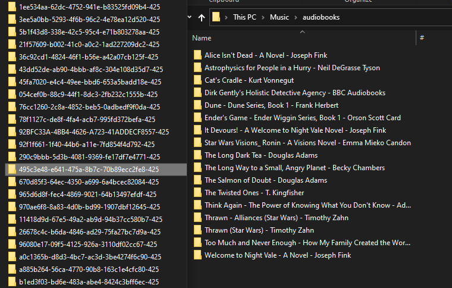

# audiobook parser/syncrhonization app 

Takes a source folder with a bunch of junk folder names and creates an output folder by "Title - Author" by reading tag data. Useful for synchronizing folders in a clean way.

Is smart enough to know if files already exist.

Use [syncthing](https://syncthing.net/) or [rsync](https://www.digitalocean.com/community/tutorials/how-to-use-rsync-to-sync-local-and-remote-directories) to sync the clean folder between multiple machines.

